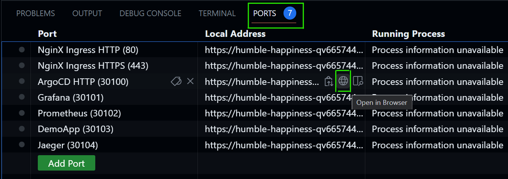
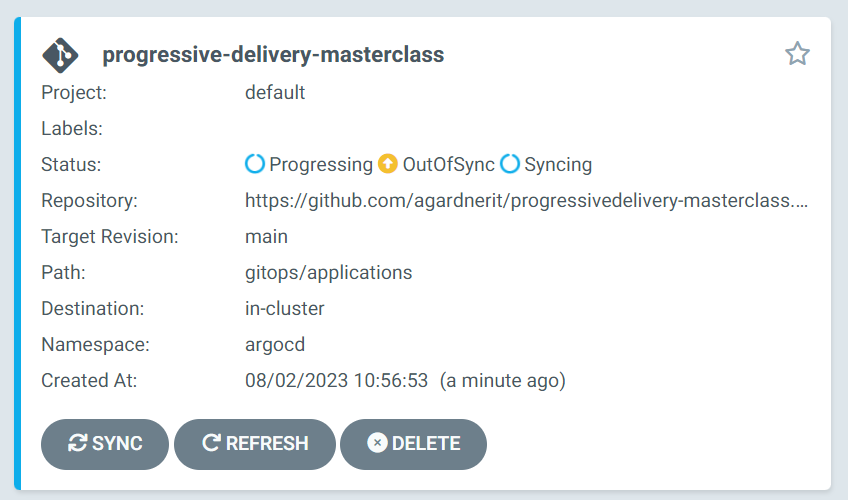
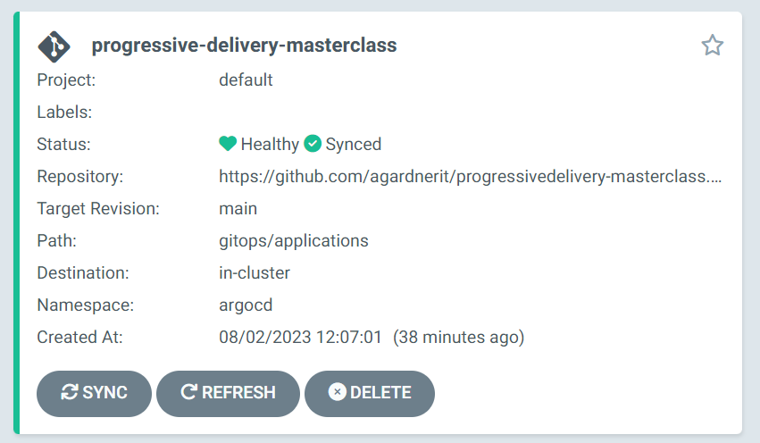

# 3. Access ArgoCD

Switch to the "Ports" tab in the terminal window. Hover over the entry for ArgoCD and click the "globe" icon

A new tab will open and the ArgoCD login screen will be displayed

## Log into ArgoCD.

The username is `admin` and the password is the random string you copied before.

If you forget the Argo password, it can be retrieved with:
   
```
kubectl -n argocd get secret argocd-initial-admin-secret -o jsonpath="{.data.password}" | base64 -d
```




## Wait for Installation

The platform stack is being installed and progress can be tracked via the `progressive-delivery-masterclass` application. This application is an "app of apps" meaning it is an application which installs other applications in turn.

The platform stack will not be ready until `progressive-delivery-masterclass` is green.



There are many applications which make up the platform. The installation will take a few moments so let's use the time to understand what's happening.

The platform is built from the following applications:

- Kubernetes
- ArgoCD
- Cert Manager
- Keptn Lifecycle Toolkit
- Grafana
- Prometheus
- Jaeger Operator (installs Jaeger)
- OpenFeature Operator (installs flagd)
- OpenTelemetry Collector

These applications are all being deployed at different times, as "bundles" or "waves", as Argo calls them.

The waves are processed in order, lowest first.

### Wave -1
- Argo configuration

### Wave 0
- Cert Manager
- Ingress NGINX

### Wave 2
- Keptn Lifecycle Toolkit
- OpenFeature Operator

### Wave 3
- Jaeger Operator
- OpenTelemetry Collector
- Prometheus
- Grafana

### Wave 4
- Feature flags configuration

### Wave 10
- Demo Application

## Wait for green

Wait until the `progressive-delivery-masterclass` application is green. This means that the stack is ready.



➡️ Next: [Access ArgoCD](3-access-argo.md) ➡️