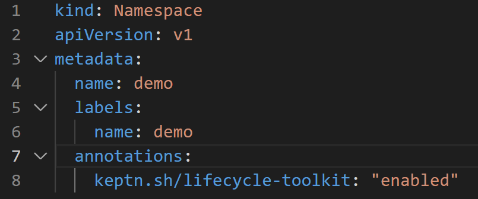
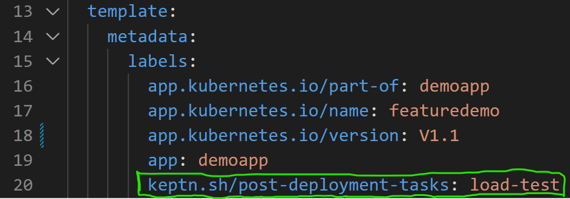
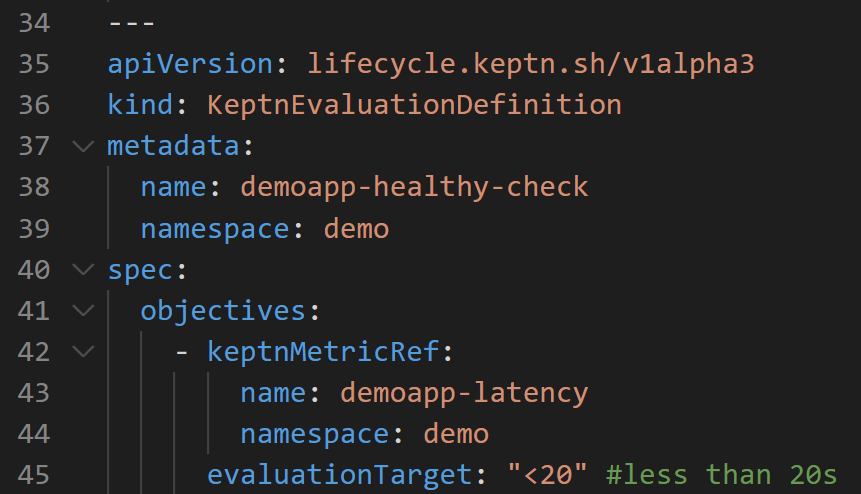

# 4. What Just Happened?

The system is now successfully running. If you look at the `demo-application` in argo you will see a few things:

1. The `demoapp` pod is runnning
1. The `demoapp` pod belongs to a deployment
1. The deployment is healthy and has a service attached and an ingress

All of this means that the application is accessible.

In the codespace, go to the `Ports` tab again, hover over the `DemoApp` and click the Globe icon to view the demo application user interface.

Inside `demo-application` the Argo application, you will also notice a some Keptn related items:

1. A `KeptnWorkload` has been created
1. An instance of a `KeptnWorkload` (a `KeptnWorkloadInstance`) also exists
1. A `KeptnTask` entity called `post-load-test` exists
1. The `post-load-test` created a `Job` and that `Job` created a `pod`
1. A `KeptnEvaluation` entity called `post-eval-demoapp-healthy` exists

## So what is going on?

The progressive delivery stack includes the Keptn.

Keptn performs multiple functions:

1. Automatically calculating deployment DORA metrics for deployments it "manages"
1. Automatically creates OpenTelemetry traces for deployments it "manages"
1. Adds the ability to perform pre-deployment and post-deployment SLO evaluations and tasks (explained below)
1. Acts as a central on-cluster metrics cache so operators can retrieve metrics without the need to know their source and other on-cluster tools (such as HPA) can utilise these metrics in a generic way

An application is "managed" by Keptn as such:

1. The namespace of the application is annotated ([see this here](https://github.com/dynatrace-oss/progressiveDelivery-masterclass/blob/main/gitops/manifests/demo-application/namespace.yaml#L7))
1. 3x annotations (or labels) are added to the application. These are the Kubernetes recommended labels `part-of`, `name` and `version` ([see this here](https://github.com/dynatrace-oss/progressiveDelivery-masterclass/blob/main/gitops/manifests/demo-application/deployment.yaml#L16-L18))

With these 4 annotations, Keptn is able to customise the Kubernetes scheduler and thus "know" when a pod is ready to be schedule and then when a pod is successfully schedule. This is how Keptn generates DORA metrics.

Keptn calculates the length of time each "managed" deployment takes. Later you will see these DORA metrics in Grafana.

## KeptnTasks

Another capability of Keptn are pre and post deployment evaluations and tasks. These also rely on annotations and CRDs. First, let's explore `KeptnTasks`

* Define a `KeptnTask` which is a custom piece of logic that you want to perform during the pod scheduling lifecycle ([see this here](https://github.com/dynatrace-oss/progressiveDelivery-masterclass/blob/main/gitops/manifests/demo-application/keptn.yaml#L1)).
    This task starts a `k6` container and executes a load test.

* Add an annotation or label to the deployment which denotes *when* this task should occur, before pod scheduling or after pod scheduling ([see this here](https://github.com/dynatrace-oss/progressiveDelivery-masterclass/blob/main/gitops/manifests/demo-application/deployment.yaml#L20)).
    This configuration tells Keptn that a `KeptnTask` called `load-test` should be executed after the deployment has completed.

`KeptnTask`s are executed as Kubernetes Jobs so the above configuration explains why we see the `KeptnTask`, `Job` and a `Pod` in ArgoCD.

## KeptnEvaluations

As explained previously the Keptn Lifecycle Toolkit also provides a way to run SLO evaluations of metrics before and / or  after deployment.

* Create a `KeptnMetricsProvider` which defines *where* the metric should be retrieved from ([see this here](https://github.com/dynatrace-oss/progressiveDelivery-masterclass/blob/main/gitops/manifests/demo-application/keptn.yaml#L15))

* Create a `KeptnMetric` which defines *which* metric should be pulled and how often ([see this here](https://github.com/dynatrace-oss/progressiveDelivery-masterclass/blob/main/gitops/manifests/demo-application/keptn.yaml#L24))

* Create a `KeptnEvaluationDefinition` to define the acceptance criteria. In other words, for a metric, what is the acceptable threshold ([see this here](https://github.com/dynatrace-oss/progressiveDelivery-masterclass/blob/main/gitops/manifests/demo-application/keptn.yaml#L35))

* Add a label to the deployment to inform Keptn that a given `KeptnEvaluationDefinition` should occur either before or after deployment. In this case, after (post) deployment ([see this here](https://github.com/dynatrace-oss/progressiveDelivery-masterclass/blob/main/gitops/manifests/demo-application/deployment.yaml#L21))

➡️ Next: [Deploy Slow Application Version](5-deploy-slow-version.md) ➡️