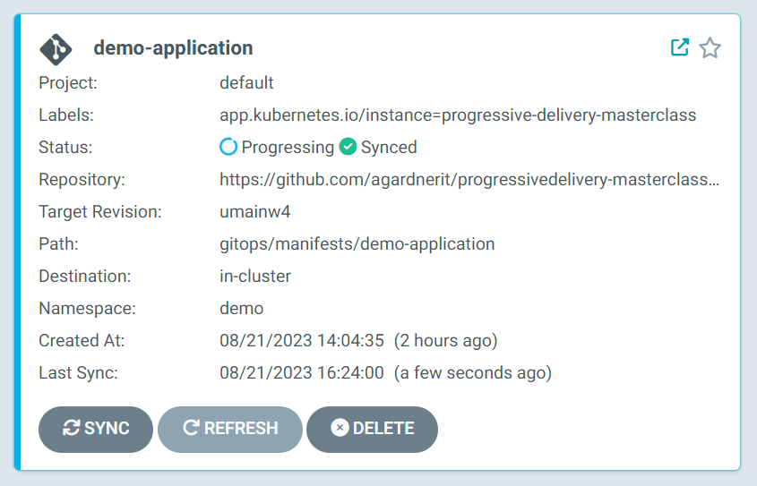

# 5. Deploy a Slow Version of the Application

A slow version of the application, `V2` will now be deployed.

The same sequence of events will occur:

* The pod will be scheduled
* A post-deployment task (load test) will run
* A post-deployment evaluation will be requested

This time though, the application is too slow, causing the `k6` response time conditions in the load test to fail.

Because the load test fails, the post-deployment evaluation will not be executed.

The pod will be running successfully (we have not tampered with the pod scheduling) but we now know that the application is unhealthy and can take action.

You will see this in argo, the `V2` pod will be running, but the Keptn resources will be unhealthy.


## Rollout V2

In the codespace:

* Open the file `gitops/manifests/demo-application/deployment.yaml`
* Update the `app.kubernetes.io/version` label to `2.0.0` and the image tag from `V1.1` to `V2`

Commit the changes to GitHub (use the commands below if you don't know how).

```shell
git add gitops/manifests/demo-application/deployment.yaml
git commit -m "rollout V2"
git push
```

In ArgoCD, find the `demo-application` and click `Refresh`.

The change will be detected and Argo will automatically begin the rollout of your update.


